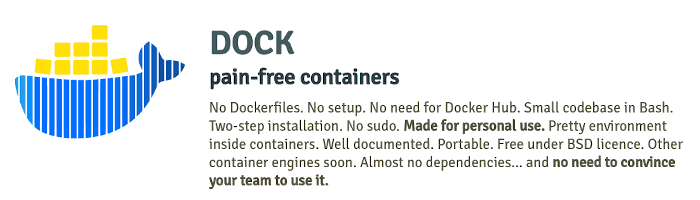

`dock` **is an alternative way to use Docker** without Dockerfiles:
cd into a dir, type `dock` and you're inside a new or existing container
with the directory mounted into it by default. It should take you 5 minutes
max to try and see it works. Report if it's more.

Please refer to the [OFFICIAL WEBSITE](https://dock.orion3.space) for clear
documentation, guidelines and other information. The website is lightweight
(only html & css) and will load faster than this Github page.

Please consider [DONATING](https://dock.orion3.space/donate.html)

INSTALLATION
------------
Download (option 1):

    curl https://dock.orion3.space/releases/dock_stable.tgz \
         -o dock_stable.tgz && tar xvzf dock_stable.tgz &&  \
         rm dock_stable.tgz

Download (option 2):

    git clone -b stable \
      https://github.com/0rion3/dock.git && cd dock && \
      git submodule init && git submodule update

Run the installation script:

    ./install

USAGE
-----

    # Non-ambigious
    dock [IMAGE_NAME] [CONTAINER_NAME]

    dock [IMAGE_NAME]     # container name implied
    dock [CONTAINER_NAME] # image name implied

    dock # both container image and name are implied

This will create/start a container and connect you to it via ssh.

ABOUT THE AUTHOR
----------------
Homepage, articles, other projects and contact information
can be found here: [orion3.space](https://orion3.space)
